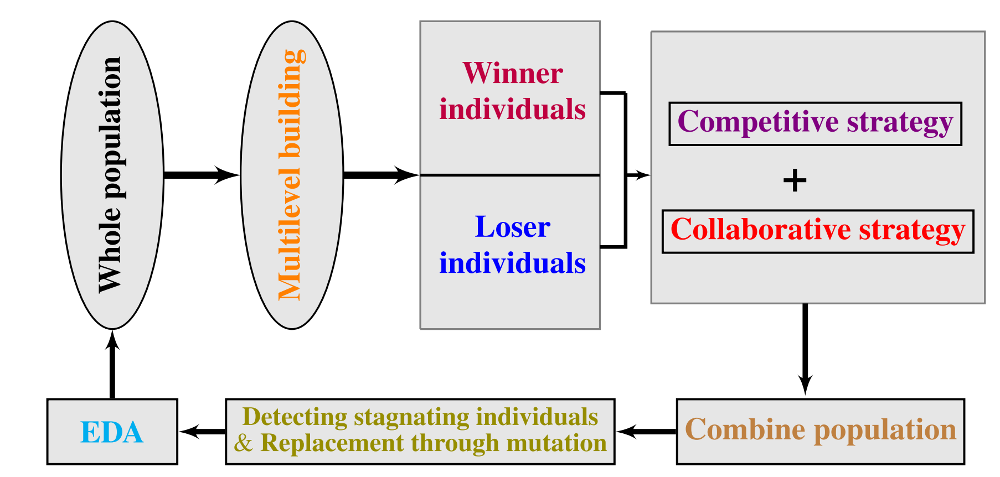
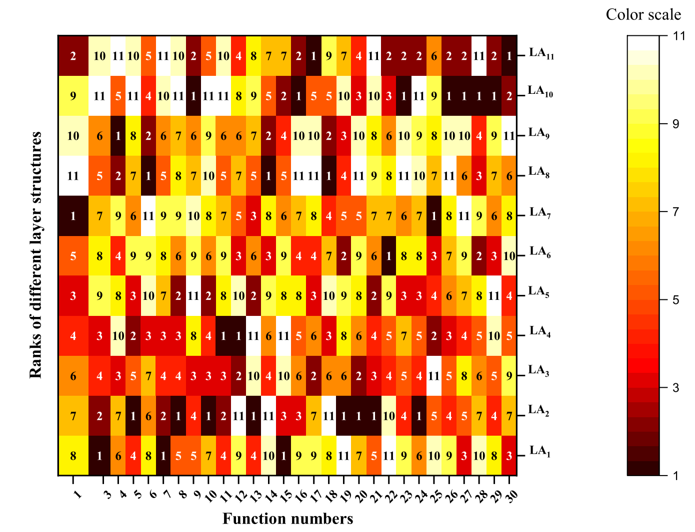
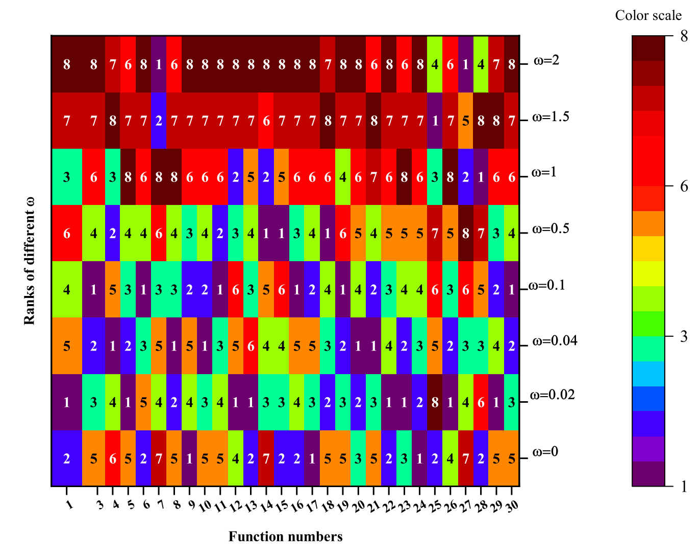
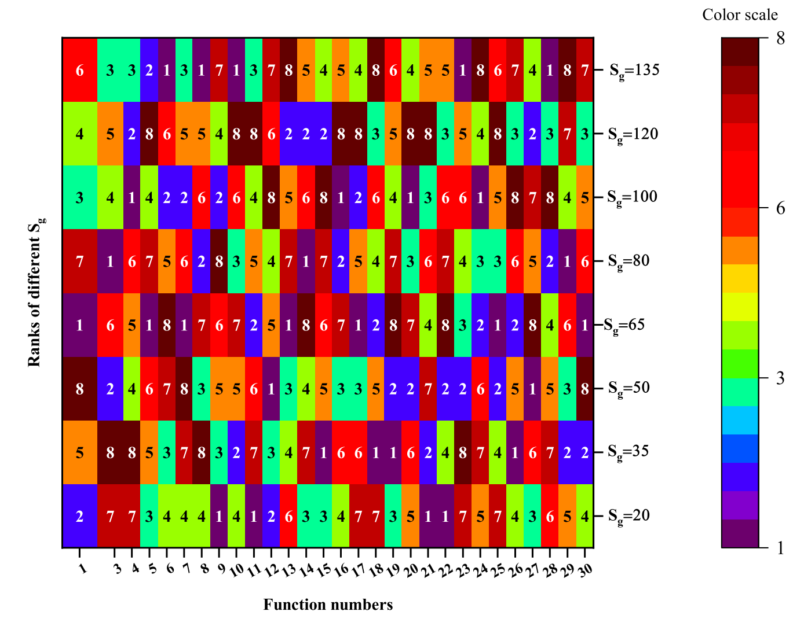
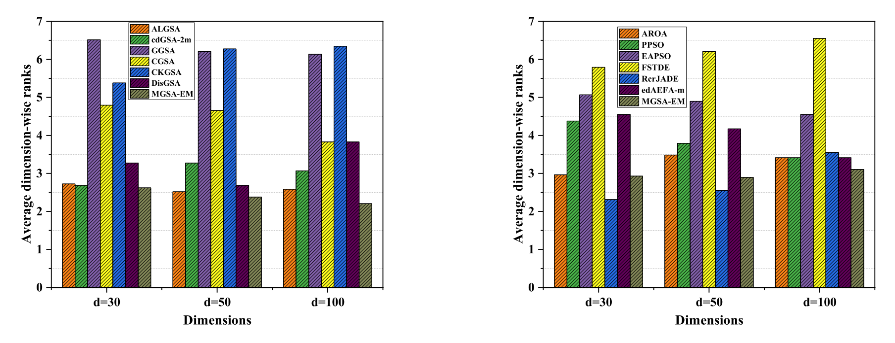
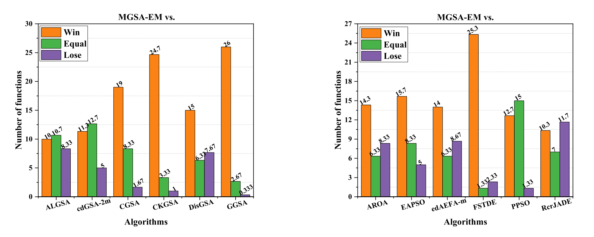

# MGSA-EM-EAAI-2026

## MGSA-EM (Restart Mechanism-based Multilevel GSA)

This repository contains a MATLAB implementation of **MGSA-EM**: a *restart mechanism-based multilevel gravitational search algorithm* (GSA) with competition–collaboration learning and an enhanced restart strategy.

It also includes an **IDE-EDA** (**I**mproved **D**ifferential **E**volution + **E**stimation of **D**istribution **A**lgorithm) module used as a restart operator when stagnation is detected.

---

## Reference Paper (MGSA-EM)

**D. Chauhan**, *Restart mechanism-based multilevel gravitational search algorithm for global optimization and image segmentation*, **Engineering Applications of Artificial Intelligence**, 163 (2026) 112904. DOI: `10.1016/j.engappai.2025.112904`

---

## What is inside

- `Main_HGSA_EM.m`
  Run this file
- `MGSA_EM.m`  
  Main MGSA-EM optimizer (multilevel structure + competition/collaboration updates + stagnation handling).
- `IDE_EDA.m`
  Population-level restart operator (**DE/current-to-pbest/1** + archive + optional EDA sampling).
- Benchmark wrappers (e.g., CEC2017), depending on your setup.

---

## Requirements

- MATLAB R2019b or later (64-bit recommended)
- (Optional) Statistics and Machine Learning Toolbox for `mvnrnd` (only needed if EDA sampling is enabled)

---

## Figures

**Example layout**
- `figures/overview.png`
- `figures/layers.png`
- `figures/omega.png`
- `figures/stagnation.png`
- `figures/statistical.png`

**Embedded figures**

<p align="center">
  
</p>
<p align="center">
  <em><b>Figure 1.</b> MGSA-EM at a glance: multilevel competition–collaboration learning coupled with an adaptive restart strategy.</em>
</p>

<p align="center">
  
</p>
<p align="center">
  <em><b>Figure 2.</b> Topology study (50D): heat map of average ranks across benchmark functions for selected population topologies.</em>
</p>

<p align="center">
  
</p>
<p align="center">
  <em><b>Figure 3.</b> Effect of <code>&omega;</code> (50D): heat map of average ranks across benchmark functions for different <code>&omega;</code> settings.</em>
</p>

<p align="center">
  
</p>
<p align="center">
  <em><b>Figure 4.</b> Stagnation threshold sensitivity (50D): heat map of average ranks across benchmark functions for different <code>Sg</code> values.</em>
</p>

<p align="center">
  
</p>
<p align="center">
  <em><b>Figure 5.</b> Overall performance: dimension-wise average rank comparison of MGSA-EM against GSA variants and state-of-the-art optimizers.</em>
</p>

<p align="center">
  
</p>
<p align="center">
  <em><b>Figure 6.</b> Win–Tie–Loss summary: average counts where MGSA-EM outperforms (Win), matches (Tie), or underperforms (Loss) compared with competitors.</em>
</p>

---

## Core idea (high level)

MGSA-EM:
1. **Sorts the population** by fitness and partitions it into **multiple layers** (top → bottom).
2. Uses **competitive learning** inside each layer: individuals are paired, producing **winners** and **losers**.
3. Updates:
   - **Losers** learn from winners (plus acceleration/guidance terms).
   - **Winners** learn from upper-layer individuals (cross-layer guidance + exploitation).
4. Tracks **stagnation** using a counter per individual (increment if no improvement, reset when improved).
5. When stagnation is severe, a **restart mechanism** is triggered using:
   - **Differential mutation** (DE/current-to-pbest/1), optionally using an **archive**,
   - plus an optional **EDA sampling** step to inject diversity.

---

## Restart mechanism: how it’s triggered (important)

**Stagnation counters** are maintained per individual. When an individual’s counter exceeds the stagnation threshold `Sg`, the restart mechanism is activated (Algorithm 5–6 in the paper).

In code, you may use either:

### Option A — Individual-level restart (only stagnated particles)
Call the restart operator **only for individuals** with `counter(i) > Sg`.

### Option B — Population-level restart (your current implementation)
Trigger IDE-EDA for the whole population only when a large fraction is stagnated, e.g.:

```matlab
stagRate = mean(counter > Sg);
if stagRate > 0.5
    [fitness, p, ...] = IDE_EDA_pop(...);
    counter(:) = 0;
end
```


---

## Citation

```bibtex
@article{chauhan2026restart,
  title   = {Restart mechanism-based multilevel gravitational search algorithm for global optimization and image segmentation},
  author  = {Chauhan, Dikshit},
  journal = {Engineering Applications of Artificial Intelligence},
  volume  = {163},
  pages   = {112904},
  year    = {2026},
  doi     = {10.1016/j.engappai.2025.112904},
  publisher = {Elsevier}
}

@article{li2023improved,
  title   = {An improved differential evolution by hybridizing with estimation-of-distribution algorithm},
  author  = {Li, Yintong and Han, Tong and Tang, Shangqin and Huang, Changqiang and Zhou, Huan and Wang, Yuan},
  journal = {Information Sciences},
  volume  = {619},
  pages   = {439--456},
  year    = {2023},
  doi     = {10.1016/j.ins.2022.11.029},
  publisher = {Elsevier}
}
